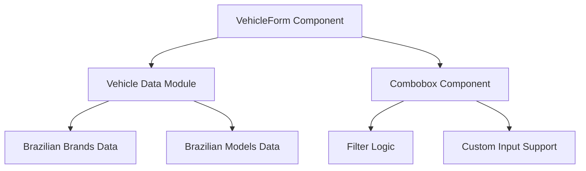

# Design Document

## Overview

Esta funcionalidade adiciona suporte para seleção de marcas e modelos de veículos (carros e motos) comercializados no Brasil na página de cadastro de veículos. A solução utiliza um componente de autocomplete/combobox que permite tanto a seleção de opções predefinidas quanto a entrada manual de valores personalizados, mantendo compatibilidade com dados existentes.

## Architecture

A arquitetura segue o padrão existente do projeto React + TypeScript + Supabase:



**Componentes principais:**
- **Vehicle Data Module**: Módulo contendo dados estruturados de marcas e modelos brasileiros
- **Combobox Component**: Componente reutilizável de seleção com autocomplete
- **VehicleForm**: Formulário existente que será atualizado para usar os novos componentes

## Components and Interfaces

### 1. Brazilian Vehicle Data Module

Arquivo: `src/lib/brazilianVehicles.ts`

```typescript
export interface VehicleBrand {
  name: string
  type: 'car' | 'motorcycle'
  models: string[]
}

export interface BrazilianVehicleData {
  brands: VehicleBrand[]
}
```

Este módulo exporta dados estruturados com:
- Marcas de carros populares no Brasil (mínimo 30)
- Marcas de motos populares no Brasil (mínimo 15)
- Modelos populares para cada marca (mínimo 10 para carros, 8 para motos)

### 2. Combobox Component

Arquivo: `src/components/Combobox.tsx`

```typescript
interface ComboboxProps {
  value: string
  onChange: (value: string) => void
  options: string[]
  placeholder?: string
  label: string
  required?: boolean
  disabled?: boolean
  allowCustom?: boolean
}
```

Funcionalidades:
- Filtro em tempo real baseado no texto digitado
- Suporte a entrada personalizada quando `allowCustom=true`
- Ordenação alfabética das opções
- Acessibilidade (ARIA labels, navegação por teclado)
- Estilo consistente com o design system existente

### 3. Updated VehicleForm Component

O componente `VehicleForm` será atualizado para:
- Substituir o input de texto de marca por um Combobox
- Adicionar um Combobox para modelo que é habilitado após seleção da marca
- Filtrar modelos baseado na marca selecionada
- Limpar o campo de modelo quando a marca é alterada
- Manter compatibilidade com valores personalizados existentes

## Data Models

### Brazilian Vehicle Brands (Cars)

Marcas incluídas (mínimo 30):
- **Nacionais**: Chevrolet, Volkswagen, Fiat, Ford, Renault
- **Asiáticas**: Toyota, Honda, Hyundai, Nissan, Mitsubishi, Kia, Suzuki, Subaru, Mazda, Lexus, Infiniti
- **Europeias**: BMW, Mercedes-Benz, Audi, Volvo, Peugeot, Citroën, Land Rover, Jaguar, Porsche, Mini
- **Americanas**: Jeep, RAM, Dodge, Chevrolet (importados)
- **Chinesas**: BYD, Caoa Chery, GWM

### Brazilian Vehicle Brands (Motorcycles)

Marcas incluídas (mínimo 15):
- Honda, Yamaha, Suzuki, Kawasaki, BMW Motorrad, Harley-Davidson, Ducati, Triumph, KTM, Royal Enfield, Dafra, Shineray, Traxx, Haojue, Kasinski

### Popular Models per Brand

Cada marca terá seus modelos mais populares no mercado brasileiro. Exemplos:
- **Volkswagen**: Gol, Polo, Virtus, T-Cross, Nivus, Taos, Tiguan, Jetta, Passat, Amarok
- **Honda (carros)**: Civic, City, HR-V, CR-V, Accord, WR-V, Fit
- **Honda (motos)**: CG 160, Biz 125, PCX, CB 500, CB 650, Africa Twin, CBR 1000RR, XRE 300

## Data Structure

```typescript
export const brazilianVehicles: BrazilianVehicleData = {
  brands: [
    {
      name: 'Volkswagen',
      type: 'car',
      models: ['Gol', 'Polo', 'Virtus', 'T-Cross', 'Nivus', 'Taos', 'Tiguan', 'Jetta', 'Passat', 'Amarok']
    },
    {
      name: 'Honda',
      type: 'motorcycle',
      models: ['CG 160', 'Biz 125', 'PCX', 'CB 500', 'CB 650', 'Africa Twin', 'CBR 1000RR', 'XRE 300']
    }
    // ... mais marcas
  ]
}
```


## Correctness Properties

*A property is a characteristic or behavior that should hold true across all valid executions of a system-essentially, a formal statement about what the system should do. Properties serve as the bridge between human-readable specifications and machine-verifiable correctness guarantees.*

### Property Reflection

Após análise dos critérios de aceitação, identifiquei as seguintes redundâncias:
- **3.2 e 2.1**: Ambos testam que selecionar uma marca exibe os modelos corretos. Se a implementação for genérica (não distingue entre carros e motos), uma única propriedade cobre ambos.
- **2.2 e 1.2**: Ambos testam filtro em tempo real. Podemos ter uma propriedade genérica de filtro que se aplica a ambos os campos.
- **5.1 e 5.2**: Ambos testam suporte a valores personalizados. Podemos combinar em uma propriedade que testa tanto marca quanto modelo.

### Properties

**Property 1: Brand filter correctness**
*For any* search string and brand list, when filtering brands by that string, all returned brands should contain the search string (case-insensitive)
**Validates: Requirements 1.2**

**Property 2: Model filter correctness**
*For any* search string and model list, when filtering models by that string, all returned models should contain the search string (case-insensitive)
**Validates: Requirements 2.2**

**Property 3: Brand selection updates model list**
*For any* brand in the system, when that brand is selected, the available models list should contain only models belonging to that brand
**Validates: Requirements 2.1, 3.2**

**Property 4: Brand change clears model**
*For any* two different brands, when selecting the first brand then selecting the second brand, the model field should be cleared and the model list should update to show only models from the second brand
**Validates: Requirements 2.3**

**Property 5: Alphabetical ordering of brands**
*For any* brand list returned by the system, the brands should be in alphabetical order (case-insensitive)
**Validates: Requirements 4.1**

**Property 6: Alphabetical ordering of models**
*For any* model list returned by the system for a given brand, the models should be in alphabetical order (case-insensitive)
**Validates: Requirements 4.2**

**Property 7: Custom value persistence**
*For any* custom brand or model string not in the predefined lists, when saving a vehicle with that custom value and then loading it, the custom value should be preserved exactly as entered
**Validates: Requirements 5.1, 5.2, 5.3**

**Property 8: Brand selection enables model field**
*For any* brand, when no brand is selected the model field should be disabled, and when a brand is selected the model field should be enabled
**Validates: Requirements 2.1**

## Error Handling

### Invalid Input Handling
- Empty strings for brand/model should be handled by form validation (required fields)
- Special characters in custom brand/model names should be allowed and properly escaped
- Very long brand/model names should be truncated in the UI but stored completely

### Data Integrity
- If a brand is not found in the predefined list, treat it as a custom brand
- If a model is not found for the selected brand, treat it as a custom model
- Maintain backward compatibility with existing vehicles that have custom brands/models

### User Feedback
- Show clear visual feedback when filtering (loading state, no results message)
- Indicate when a custom value is being used vs. a predefined option
- Provide helpful placeholder text in the combobox components

## Testing Strategy

### Unit Tests

Unit tests will cover specific examples and edge cases:

1. **Data validation tests**:
   - Verify minimum number of car brands (30)
   - Verify minimum number of motorcycle brands (15)
   - Verify minimum number of models per car brand (10)
   - Verify minimum number of models per motorcycle brand (8)
   - Verify visual separation between car and motorcycle brands

2. **Component rendering tests**:
   - Verify Combobox component renders with correct props
   - Verify brand field is a Combobox, not a plain input
   - Verify custom input is allowed when no matches found

3. **Edge case tests**:
   - Empty search string returns all options
   - Search with no matches allows custom input
   - Selecting a brand with no models handles gracefully

### Property-Based Tests

Property-based tests will verify universal behaviors across all inputs using a PBT library appropriate for React/TypeScript (such as `fast-check`):

1. **Filter properties**: Generate random search strings and verify filter correctness (Properties 1, 2)
2. **Selection properties**: Generate random brand selections and verify model list updates (Properties 3, 4, 8)
3. **Ordering properties**: Verify alphabetical ordering holds for all brand/model lists (Properties 5, 6)
4. **Persistence properties**: Generate random custom values and verify round-trip persistence (Property 7)

Each property-based test should:
- Run a minimum of 100 iterations
- Be tagged with a comment referencing the design document property
- Use the format: `**Feature: brazilian-vehicle-brands-models, Property {number}: {property_text}**`

### Testing Framework

- **Unit tests**: Vitest (already used in React/Vite projects)
- **Property-based tests**: fast-check (TypeScript/JavaScript PBT library)
- **Component tests**: React Testing Library

## Implementation Notes

### Performance Considerations
- Brand and model data is static and can be imported directly (no API calls needed)
- Filter operations should be debounced to avoid excessive re-renders
- Consider memoizing filtered results for better performance

### Accessibility
- Combobox component must support keyboard navigation (arrow keys, enter, escape)
- Proper ARIA labels and roles for screen readers
- Focus management when opening/closing the dropdown

### Internationalization
- All brand and model names are proper nouns and should not be translated
- UI labels (placeholders, error messages) should be in Portuguese (pt-BR)

### Future Enhancements
- Add ability for admins to manage the brand/model list through the admin panel
- Track usage statistics to identify which brands/models are most commonly used
- Add support for vehicle variants (e.g., "Civic LX", "Civic EX")
