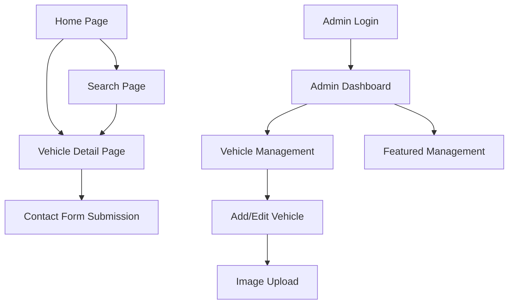

## 1. Product Overview
Sistema web completo para concessionária de veículos premium com catálogo digital, sistema de busca avançada e administração integrada. Permite aos usuários explorar veículos, filtrar por diversos critérios e entrar em contato com a concessionária, enquanto os administradores gerenciam o inventário e destaques.

- Resolve o problema de gestão e exibição profissional de veículos em concessionárias
- Público-alvo: Concessionárias de veículos premium e seus clientes
- Agiliza o processo de descoberta e contato por veículos específicos

## 2. Core Features

### 2.1 User Roles
| Role | Registration Method | Core Permissions |
|------|---------------------|------------------|
| Visitor | No registration required | Browse vehicles, use search filters, submit contact forms |
| Admin | Secure admin registration | Full CRUD on vehicles, manage highlights, view dashboard metrics |

### 2.2 Feature Module
Nosso sistema de concessionária consiste nos seguintes módulos principais:

1. **Home page**: Veículos em destaque, seção promocional, navegação principal
2. **Vehicle detail page**: Galeria de imagens, especificações técnicas, formulário de contato
3. **Search page**: Filtros avançados, ordenação, visualização lista/grade
4. **Admin dashboard**: Métricas, gerenciamento de veículos e destaques
5. **Admin vehicle management**: CRUD completo de veículos com upload de imagens
6. **Authentication**: Login seguro para administradores

### 2.3 Page Details
| Page Name | Module Name | Feature description |
|-----------|-------------|---------------------|
| Home page | Hero section | Apresentação visual premium com destaques promocionais e call-to-action principal |
| Home page | Featured vehicles | Carrossel ou grid responsivo dos veículos em destaque com imagens e informações básicas |
| Home page | Navigation | Menu superior com acesso às principais seções e link para área administrativa |
| Vehicle detail page | Image gallery | Galeria responsiva com múltiplas imagens do veículo, navegação por thumbnails e visualização ampliada |
| Vehicle detail page | Technical specs | Tabela detalhada com especificações técnicas completas do veículo (motor, performance, dimensões) |
| Vehicle detail page | Contact form | Formulário de interesse com campos para nome, email, telefone e mensagem personalizada |
| Search page | Advanced filters | Filtros por marca, modelo, ano, preço mínimo/máximo, quilometragem, combustível e categoria |
| Search page | Sort options | Ordenação por preço (menor/maior), ano (mais novo/mais antigo), marca e modelo |
| Search page | View toggle | Alternância entre visualização em lista (mais detalhes) e grade (mais compacta) |
| Admin dashboard | Metrics overview | Cards com total de veículos, destaques ativos, interesses recebidos e visualizações recentes |
| Admin dashboard | Quick actions | Acesso rápido para adicionar novo veículo e gerenciar destaques |
| Admin vehicle management | Vehicle CRUD | Interface completa para criar, visualizar, editar e excluir veículos do catálogo |
| Admin vehicle management | Image upload | Sistema de upload múltiplo de imagens com preview e ordenação |
| Admin vehicle management | Featured management | Toggle para marcar/desmarcar destaque e definir ordem de exibição |
| Authentication | Admin login | Formulário seguro de login com validação e controle de sessão |

## 3. Core Process
### Visitor Flow
O visitante acessa a homepage, visualiza os destaques, pode navegar para a página de busca para filtrar veículos por diversos critérios. Ao encontrar um veículo de interesse, acessa a página de detalhes onde visualiza imagens e especificações, podendo enviar um formulário de contato demonstrando interesse.

### Admin Flow
O administrador faz login na área restrita, acessa o dashboard com métricas gerais. Pode gerenciar veículos através do CRUD completo, controlar quais aparecem em destaque na homepage, e visualizar os interesses recebidos através dos formulários de contato.

## 4. User Interface Design

### 4.1 Design Style
- **Cores primárias**: Preto (#000000), Branco (#FFFFFF), Cinza metálico (#C0C0C0)
- **Cores secundárias**: Azul escuro premium (#1E3A8A), Dourado (#D4AF37) para detalhes
- **Botões**: Estilo minimalista com bordas sutis, efeitos hover suaves
- **Tipografia**: Fonte sans-serif moderna (Inter ou similar), hierarquia clara de tamanhos
- **Layout**: Card-based com espaçamento generoso, grid de 12 colunas responsivo
- **Ícones**: Estilo outline minimalista, consistente com design premium automotivo

### 4.2 Page Design Overview
| Page Name | Module Name | UI Elements |
|-----------|-------------|-------------|
| Home page | Hero section | Imagem de fundo full-width com overlay escuro, texto em branco, botão CTA dourado com hover effect |
| Home page | Featured vehicles | Cards horizontais com imagem 16:9, título em negrito, preço destacado em azul premium, badges de destaque |
| Vehicle detail page | Image gallery | Container principal com proporção 4:3, thumbnails horizontais abaixo, navegação por setas laterais |
| Vehicle detail page | Technical specs | Tabela zebra com fundo alternado, headers em cinza metálico, fonte monoespaçada para números |
| Search page | Filters sidebar | Sidebar colapsável em mobile, filtros em accordion, botões de ação sticky no footer |
| Search page | Results grid | Cards responsivos com breakpoint em 3 colunas (desktop), 2 (tablet), 1 (mobile), lazy loading de imagens |
| Admin dashboard | Metrics cards | Cards com ícones grandes, números em fonte bold, variação percentual em verde/vermelho |
| Admin forms | Input fields | Campos com bordas arredondadas, labels flutuantes, validação visual em tempo real |

### 4.3 Responsiveness
- **Desktop-first**: Design otimizado para telas grandes (1920x1080), com elementos aproveitando espaço horizontal
- **Mobile-adaptive**: Breakpoints em 768px (tablet) e 480px (mobile), menu hamburger, cards empilhados verticalmente
- **Touch optimization**: Botões com área de toque mínima de 44x44px, gestos de swipe na galeria de imagens
- **Performance**: Imagens responsivas com srcset, lazy loading implementado, compressão automática