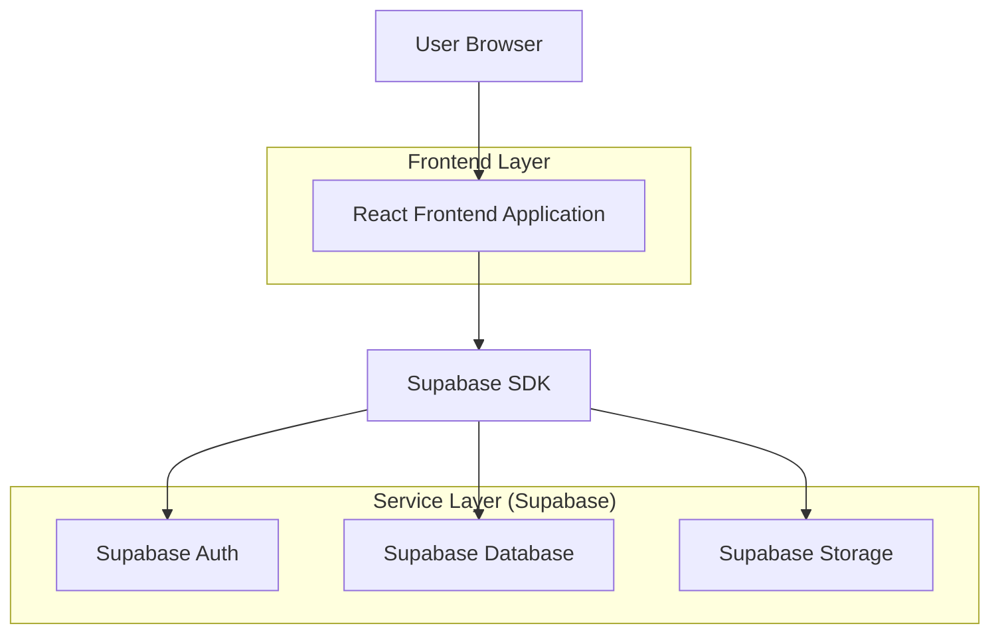
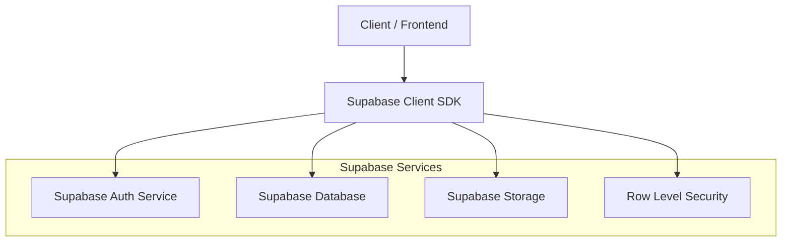
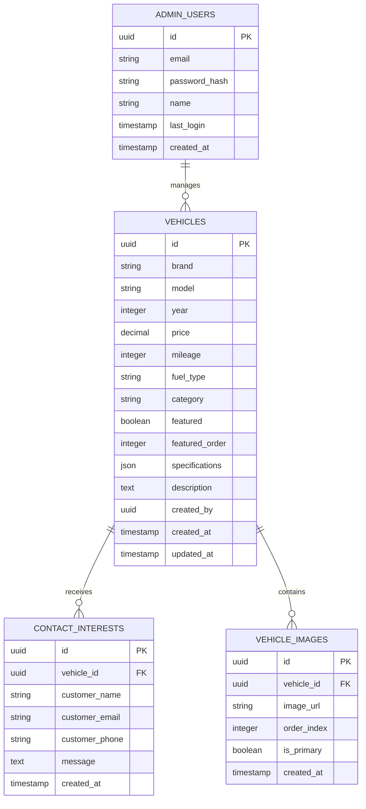

## 1. Architecture design



## 2. Technology Description

- Frontend: React@18 + tailwindcss@3 + vite
- Backend: Supabase (BaaS completo)
- Database: PostgreSQL (via Supabase)
- Storage: Supabase Storage para imagens
- Authentication: Supabase Auth

## 3. Route definitions

| Route | Purpose |
|-------|---------|
| / | Homepage com veículos em destaque e seções promocionais |
| /search | Página de busca com filtros avançados e resultados |
| /vehicle/:id | Página de detalhes do veículo com galeria e especificações |
| /admin/login | Login seguro para administradores |
| /admin/dashboard | Dashboard administrativo com métricas e ações rápidas |
| /admin/vehicles | Gerenciamento completo de veículos (CRUD) |
| /admin/vehicles/new | Formulário para adicionar novo veículo |
| /admin/vehicles/edit/:id | Formulário para editar veículo existente |

## 4. API definitions

### 4.1 Vehicle API

```
GET /api/vehicles
```

Query Parameters:
| Param Name | Param Type | isRequired | Description |
|------------|-------------|-------------|-------------|
| brand | string | false | Filtrar por marca do veículo |
| model | string | false | Filtrar por modelo do veículo |
| year_min | number | false | Ano mínimo do veículo |
| year_max | number | false | Ano máximo do veículo |
| price_min | number | false | Preço mínimo do veículo |
| price_max | number | false | Preço máximo do veículo |
| fuel_type | string | false | Tipo de combustível (gasoline, diesel, electric, hybrid) |
| category | string | false | Categoria do veículo (sedan, suv, hatchback, etc) |
| featured | boolean | false | Retornar apenas veículos em destaque |
| sort_by | string | false | Ordenar por (price_asc, price_desc, year_asc, year_desc) |
| page | number | false | Página de resultados (paginação) |
| limit | number | false | Limite de resultados por página |

Response:
```json
{
  "data": [
    {
      "id": "uuid",
      "brand": "string",
      "model": "string",
      "year": "number",
      "price": "number",
      "mileage": "number",
      "fuel_type": "string",
      "category": "string",
      "images": ["string"],
      "featured": "boolean",
      "specifications": "object",
      "created_at": "timestamp"
    }
  ],
  "total": "number",
  "page": "number",
  "total_pages": "number"
}
```

```
POST /api/contact
```

Request:
| Param Name | Param Type | isRequired | Description |
|------------|-------------|-------------|-------------|
| vehicle_id | string | true | ID do veículo de interesse |
| name | string | true | Nome do interessado |
| email | string | true | Email do interessado |
| phone | string | true | Telefone do interessado |
| message | string | false | Mensagem adicional |

## 5. Server architecture diagram



## 6. Data model

### 6.1 Data model definition



### 6.2 Data Definition Language

**Vehicles Table**
```sql
CREATE TABLE vehicles (
    id UUID PRIMARY KEY DEFAULT gen_random_uuid(),
    brand VARCHAR(50) NOT NULL,
    model VARCHAR(100) NOT NULL,
    year INTEGER NOT NULL CHECK (year >= 1900 AND year <= EXTRACT(YEAR FROM NOW()) + 1),
    price DECIMAL(10, 2) NOT NULL CHECK (price > 0),
    mileage INTEGER NOT NULL CHECK (mileage >= 0),
    fuel_type VARCHAR(20) NOT NULL CHECK (fuel_type IN ('gasoline', 'diesel', 'electric', 'hybrid')),
    category VARCHAR(30) NOT NULL CHECK (category IN ('sedan', 'suv', 'hatchback', 'pickup', 'coupe', 'convertible', 'wagon')),
    featured BOOLEAN DEFAULT FALSE,
    featured_order INTEGER DEFAULT 0,
    specifications JSONB,
    description TEXT,
    created_by UUID REFERENCES auth.users(id),
    created_at TIMESTAMP WITH TIME ZONE DEFAULT NOW(),
    updated_at TIMESTAMP WITH TIME ZONE DEFAULT NOW()
);

CREATE INDEX idx_vehicles_brand ON vehicles(brand);
CREATE INDEX idx_vehicles_model ON vehicles(model);
CREATE INDEX idx_vehicles_year ON vehicles(year);
CREATE INDEX idx_vehicles_price ON vehicles(price);
CREATE INDEX idx_vehicles_featured ON vehicles(featured);
CREATE INDEX idx_vehicles_category ON vehicles(category);
```

**Vehicle Images Table**
```sql
CREATE TABLE vehicle_images (
    id UUID PRIMARY KEY DEFAULT gen_random_uuid(),
    vehicle_id UUID NOT NULL REFERENCES vehicles(id) ON DELETE CASCADE,
    image_url TEXT NOT NULL,
    order_index INTEGER DEFAULT 0,
    is_primary BOOLEAN DEFAULT FALSE,
    created_at TIMESTAMP WITH TIME ZONE DEFAULT NOW()
);

CREATE INDEX idx_vehicle_images_vehicle_id ON vehicle_images(vehicle_id);
CREATE INDEX idx_vehicle_images_order ON vehicle_images(vehicle_id, order_index);
```

**Contact Interests Table**
```sql
CREATE TABLE contact_interests (
    id UUID PRIMARY KEY DEFAULT gen_random_uuid(),
    vehicle_id UUID NOT NULL REFERENCES vehicles(id) ON DELETE CASCADE,
    customer_name VARCHAR(100) NOT NULL,
    customer_email VARCHAR(255) NOT NULL,
    customer_phone VARCHAR(20) NOT NULL,
    message TEXT,
    created_at TIMESTAMP WITH TIME ZONE DEFAULT NOW()
);

CREATE INDEX idx_contact_interests_vehicle_id ON contact_interests(vehicle_id);
CREATE INDEX idx_contact_interests_created_at ON contact_interests(created_at DESC);
```

**Row Level Security Policies**
```sql
-- Permissões para visitantes (leitura apenas)
GRANT SELECT ON vehicles TO anon;
GRANT SELECT ON vehicle_images TO anon;

-- Permissões para usuários autenticados (admin)
GRANT ALL PRIVILEGES ON vehicles TO authenticated;
GRANT ALL PRIVILEGES ON vehicle_images TO authenticated;
GRANT ALL PRIVILEGES ON contact_interests TO authenticated;

-- Políticas de segurança
CREATE POLICY "Anyone can view vehicles" ON vehicles FOR SELECT USING (true);
CREATE POLICY "Anyone can view vehicle images" ON vehicle_images FOR SELECT USING (true);
CREATE POLICY "Anyone can submit contact interest" ON contact_interests FOR INSERT WITH CHECK (true);
CREATE POLICY "Admins can manage vehicles" ON vehicles FOR ALL TO authenticated USING (true);
CREATE POLICY "Admins can manage vehicle images" ON vehicle_images FOR ALL TO authenticated USING (true);
CREATE POLICY "Admins can view contacts" ON contact_interests FOR SELECT TO authenticated USING (true);
```